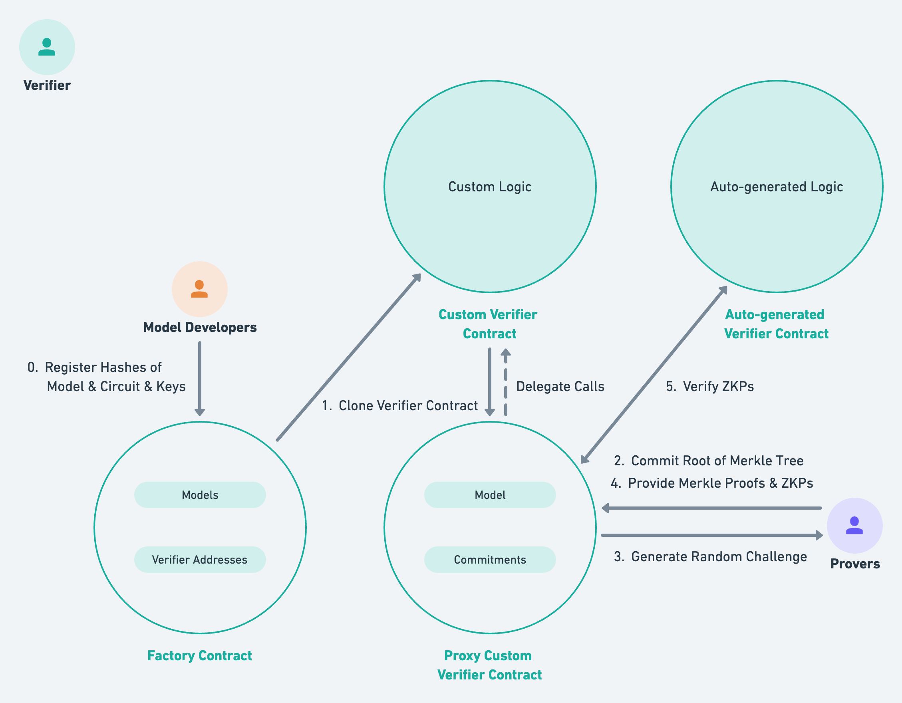
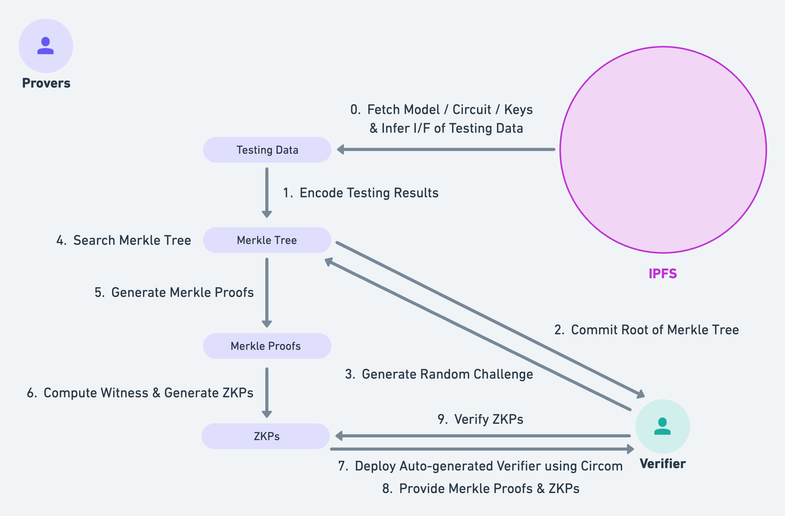

# Optimization of On-Chain Machine Learning

*This is a grant project of PSE Team @ Ethereum Foundation*
*A blogpost and demo by [@SeiyaKobayashi](https://github.com/SeiyaKobayashi)*

## Introduction

Zero-knowledge proof (ZKP) has been one of the hottest topics in layer 2 solutions on public blockchains in the past few years. From enhancing scalability to securing privacy, ZKP plays a critical role to tackle with the constraints of the public nature of blockchains.

From the research and development side, one of the key milestones would be a project called [`zk-mnist`](https://github.com/0xZKML/zk-mnist) that researchers from [0xPARC](https://0xparc.org/) had done from 2021 to 2022. They conceptualized the idea of **private machine learning**, a way to execute machine learning operations on public blockchains while shielding either weights of a model or inputs to a model using ZKPs, and implemented a demo app for a simple CNN (convolutional neural network) for handwritten digit recognition (MNIST).

This blogpost, along with the associated GitHub [repo](https://github.com/SeiyaKobayashi/zkml-optimization), further explores how we could generalize and optimize such on-chain private machine learning. 

## Motivation

Let's say we would like to do private machine learning with public models and private inputs using ZKPs. Recall that ZKP is a proof that a given cryptographically verifiable statement is true while revealing nothing about the statement itself. In this case, we would like to prove that **a public model actually makes predictions, whether the predictions themselves are correct or not, for some private testing data**. In other words, only those who have access to some private testing data are able to compute valid ZKPs that are then verified by a verifier.

The demo app of [`zk-mnist`](https://github.com/0xZKML/zk-mnist) takes upto only a few testing images to prove and verify, yet in practical situations, each party could be assumed to have at least tens of thousands of testing data. The most critical problem then would be that **it may take way too much time for proving and verifying ZKPs**, even with widely-used efficient algorithms such as `Groth16` or `PlonK`. This obviously depends on the size of constraints of arithmetic circuits, yet it could be optimized in a way that we randomly select just a few testing data that we actually generate ZKPs for.

Another room for enhancement would be the ability of taking a wide variety of models other than just a CNN for MNIST. To achive this, we have integrated a Circom transpiler called [keras2circom](https://github.com/socathie/keras2circom) that [*@Cathie*](https://twitter.com/drCathieSo_eth) from PSE team of Ethereum Foundation had implemented recently to our program.  

## Program Architecture

We have designed our program in way that it satisfies the ideas of enhancements briefly discussed in the previous section. The program consists of mainly three parts: `verifiers`, `model-developers`, and `prover-clients`.

### 1. Verifier Contracts

As the name suggests, verifier contracts verify ZKPs with the given verification key. On top of ZKP verification, the contracts do a lot of things, including but not limited to registering models, generating random challenges, and verifying Merkle proofs.



We have the following three smart contracts. We could have a single gigantic contract combining `CustomVerifierFactory` and `CustomVerifier`, yet we intentionally separated it into two contracts for the sake of reducing code complexity. 

- **`CustomVerifierFactory`**: A contract model developers interact with. It spawns a proxy custom verifier contract from `CustomVerifier` when a new model is registered. 
- **`CustomVerifier`**: A contract prover clients interact with. It implements a commit-reveal scheme using a Merkle tree, and all the other necessary logics for optimization. 
- **`Verifier`**: A contract that is called from `CustomVerifier` when verifyng a ZKP. This contract is auto-generated by model developers via Circom. 

### 2. Model Developers

A model developer is one client of the verifier contracts. We assume they already have trained models, so they transpile models to Circom-compatible circuits and register the hashes returned from IPFS to the verifier.


A model developer is responsible for the following, so that prover clients are easily able to generate ZKPs and send them to the verifier for verification.

- **Model Training**: They should have trained a model using their training data. The model is uploaded to IPFS later, thus a **public** model. Note that they don't have to upload their training data because what matters the most when it comes to ML models is **set of the weights**, not the model architecture or data used for training.
- **Circuit Generation**: We use [`keras2circom`](https://github.com/socathie/keras2circom) as a way to convert a model into a Circom-compatible arithmetic circuit. It takes `.h5` file and produces `.circom` as well as `.json` files.
- **ZKey Generation**: After compiling a circuit, they generate keys used for generating and verifying a ZKP. Specifically, a verification key is used when auto-generating a verifier contract. 
- **File Upload to IPFS**: It is generally not a good idea to store large data such as a model file on blockchain. Instead, we use [IPFS](https://ipfs.tech/) for storing and hashing large data. 
- **Model Registration**: They finally register a content ID (i.e., resulting hash value from IPFS) along with model details to the verifier. 

### 3. Prover Clients

A prover client is another yet the most important client of the verifier contracts. They fetch registered models and circuits from IPFS, encode testing results as a Merkle tree, generate and send ZKPs along with Merkle proofs of the randomly selected testing results to the verifier.



A model developer is responsible for the following.

- **Testing Results Encoding**: After fetching a model, a ciruit, and zkeys from IPFS, they run the model against their private testing data. We use a data structure called **Merkle tree** to encode the testing results (see below for more detail).
- **Commitment of Merkle Root**: We use a commit-reveal scheme to ensure that provers are being honest about their testing results. Since a hash value of Merkle root can be computed from a valid Merkle proof, we only commit the Merkle root of the generated Merkle tree.
- **Generation of Merkle Proofs**: After committing the Merkle root, the verifier generates **a random challenge** of type `bytes32`. Using the challenge, they search their Merkle tree to find the matched leaf nodes, and then generate Merkle proof for each leaf node (see below for more detail).
- **Generation of ZKPs**: After filtering the testing results, they generate ZKPs using the proving key fetched from IPFS. 
- **Providing Merkle Proofs and ZKPs**: Finally, they send both Merkle proofs and ZKPs to the verifier. The verifier reveals the commitment, verify ZKPs, and returns the verification result to them.

#### Q: Why Using Merkle Tree?


<p style="text-align: center;">image from https://en.wikipedia.org/wiki/Merkle_tree</p>

A Merkle tree is basically a binary (not necessarily) hash tree, where leaf nodes are the hashes of data and inner nodes are the hashes of their children. What's remarkable about a Merkle tree is that it is computationally easy to prove that some data is contained in a tree (this is called a **Merkle proof**). For example, in order to prove that `L1` data block in the image above is contained in a tree, we just compare the root hash to a Merkle proof of array of [`Hash 0-1`, `Hash 1`]. This is why it's ideal for using in a commit-reveal scheme. We are using [`merkle-tree`](https://github.com/OpenZeppelin/merkle-tree) library from `OpenZeppelin` for Merkle tree operations.

#### Q: How Do We Search Merkle Tree?

We compare the last N bits of the random challenge to those of hash value of each leaf node to filter out the testing results. We set the size of `N` as `difficulty` when deploying a contract. For example, if `difficulty == 10`, we can expect ${x \over 2^{10}}$ (where x = size of testing data) leaf nodes to be selected. You can take a look at the source code below. As can be seen, we are using previous block hash and block timestamp as a source of randomness. With this filtering logic, prover clients end up with significantly less number of testing results for ZKP generation, meaning the cost of generating ZKPs gets substantially reduced. 

```solidity
/**
 * @title Library of challenge generation algorithm
 * @author Seiya Kobayashi
 */
library Challenge {
    /**
     * @notice Generate a random challenge.
     * @dev Generate a challenge of random 32 bytes (bytes32) of the given difficulty.
     * @param _difficulty Difficulty of challenge
     * @return challenge Generated challenge
     */
    function generateChallenge(
        uint256 _difficulty
    ) internal view returns (bytes32) {
        return
            Bytes.getLastNBits(
                keccak256(
                    abi.encodePacked(
                        blockhash(block.number - 1),
                        block.timestamp,
                        msg.sender
                    )
                ),
                _difficulty
            );
    }
}
```

```solidity
/**
 * @title Library of some useful bytes operations
 * @author Seiya Kobayashi
 */
library Bytes {
    /**
     * @dev Get last N bits (not bytes) of the given hash value.
     * @param _hash Hash value
     * @param _n Length of bits to get
     * @return tail Last N bits of hash
     */
    function getLastNBits(
        bytes32 _hash,
        uint256 _n
    ) internal pure returns (bytes32) {
        return bytes32(uint256(_hash) % 2 ** _n);
    }
}
```

## Demo

You can find our GitHub repo from [here](https://github.com/SeiyaKobayashi/zkml-optimization). Please follow the instructions in `README`s to set up and play with the demo CLI app in your local environment. Although we cover almost all the installaton precedures, you may need to install and configure package installers such as `homebrew` and `pip`, if not installed yet.

## Future Discussions

Our program is only for the demo purpose yet. There are some issues we should consider to make it suitable for more practical, real-world usecases.

#### Shape of Testing Data

  After fetching a model from IPFS, prover clients have to pre-process their testing data to satisfy the interface of inputs to the model. We may use [TensorflowJS](https://github.com/tensorflow/tfjs) to infer the shape and type of testing data from a model. Currently, the demo app only accepts our demo model and demo testing data. 

#### Value of `difficulty`

  The value of `difficulty` should be set dynamically depending on the size of testing data, yet otherwise prover clients might have to request the verifier to re-generate a random challenge again and again. For now, we set `difficulty` as a constant value, although prover clients can call a method `updateDifficulty` that updates the value of`difficulty`.

#### Merkle Tree Encoding

  A Merkle tree is constructed by computing hashes from its leaf nodes, meaning **the resulting root hash depends directory on the order of its leaf nodes**. If this contract gets incentivized (e.g., minting tokens upon successful ZKP verification), malicious provers can just modify the order of the same testing data to generate a different root hash, which then allows them to send ZKPs as a different commitment for the rewards. 

#### Circuit Implementation

  It is still far from being practical to transpile huge models with millions of layers to arithmetic circuits. Even if we end up having such a circuit with millions of constraints, the cost of generating zkeys as well as that of generating ZKPs are non-negligible and significantly high. There are some ongoing projects regarding circuit optimization of zero-knowledge machine learning, such as [`zator`](https://github.com/lyronctk/zator).
  
## Conclusion

Using smart contracts in conjunction with ZK-SNARKs and Merkle trees, we were able to successfully develop a working implementation of the optimized, universal architecture of zero-knowledge machine learning (ZKML). While we implemented an demo app only for the combination of public model and private inputs, the implementation of the other way around (i.e., ZKML with private model and public inputs) would be essentially the same. We do have some potential enhencements for our program, however, we hope this project would be a first step to make ZKML much more practical and prevalent in the near future.

## References

- [GitHub Repo](https://github.com/SeiyaKobayashi/zkml-optimization)
- Find me on SNS: **Seiya Kobayashi**
    - [GitHub](https://github.com/SeiyaKobayashi)
    - [Facebook](https://www.facebook.com/seiya.kb)
    - Telegram: `@seiya_kobayashi`
    - Discord: `Seiya #9483`
