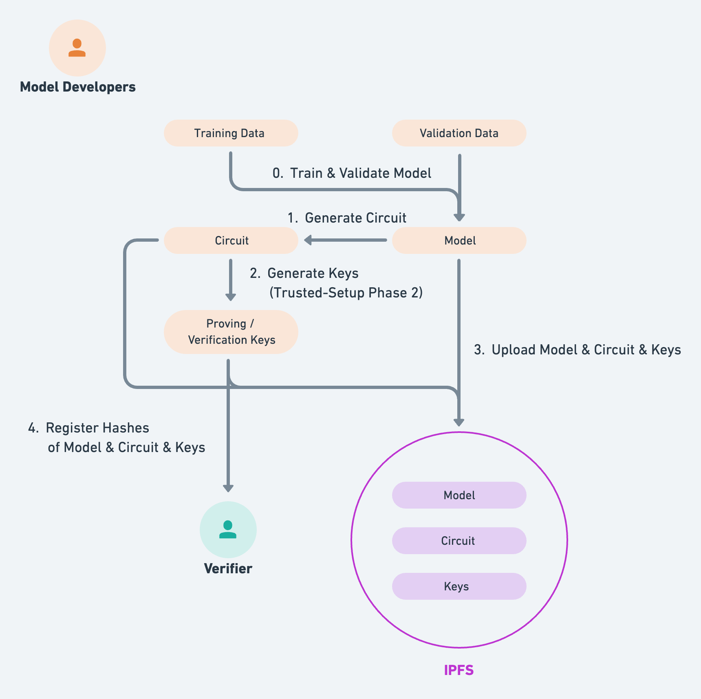

# Model Developers

Setup procedures for using this program as model developers.

## Architecture Diagram



## 0. Installation

- Read and follow instructions of `circuits` directory first (i.e. **Need to clone `.ptau` file into `circuits` directory**).
- Run the following commands **for the first time only**, where `xxx` refers to the name of binary of your local environment. See the list of binaries available from [here](https://dist.ipfs.tech/#go-ipfs) (the first command fetches masOS binary by default, if `IPFS_BINARY` is not specified).
- We are using [IPFS](https://ipfs.tech/) for storing and sharing static assets distributively.  

```sh
# setup circom (no need to execute this command twice unless you manually deleted 'circom' directory)
$ yarn setup-circom

# setup go-ipfs (no need to execute this command if IPFS repo already exists in your environment)
$ yarn setup-ipfs --IPFS_BINARY=${xxx}
```

## 1. Compiling Circuit

Run the following command, where `xxx` refers to file name of the circuit you would like to compile (this command compiles `demo-circuit.circom` by default, if `CIRCUIT_NAME` is not specified).

```sh
$ yarn compile-circuit --CIRCUIT_NAME=${xxx}
```

## 2. Generating Keys

Run the following command, where each argument refers to the following.

| Argument Name | Description | Default |
|--------------:|-------------|---------|
| **R1CS_FILENAME** | name of `.r1cs` file | `demo-circuit` |
| **PTAU_FILENAME** | name of `.ptau` file | `powersOfTau28_hez_final_17` |
| **ZKEY_FILENAME** | name of intermediate `.zkey` file | `demo_0000` |
| **ZKEY_FINAL_FILENAME** | name of final `.zkey` file | `demo_0001` |

```sh
$ yarn generate-keys --R1CS_FILENAME=${aaa} --PTAU_FILENAME=${bbb} --ZKEY_FILENAME=${ccc} --ZKEY_FINAL_FILENAME=${ddd}
```

## 3. Uploading Files to IPFS

Run the following commands, where each argument refers to the following.

| Argument Name | Description | Default |
|--------------:|-------------|---------|
| **CIRCUIT_NAME** | name of `.circom` file | `demo-circuit` |
| **MODEL_NAME** | name of `.h5` file | `demo` |
| **ZKEY_NAME** | name of final `.zkey` file | `demo_0001` |

```sh
# connect to ipfs p2p network
$ yarn connect-to-ipfs

# upload files to ipfs
$ yarn upload-to-ipfs --CIRCUIT_NAME=${aaa} --MODEL_NAME=${bbb} --ZKEY_NAME=${ccc}
```

## 4. Registering Model to Verifier Contract

WIP
